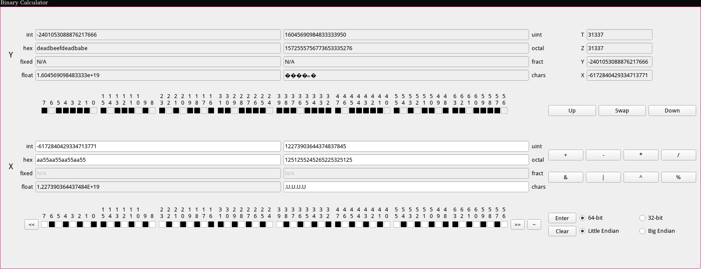

# bincalc

This is an RPN binary calculator written with qt.



## Build

`qmake` still works:

```sh
make -j4
```

The checked-in `GNUmakefile` wraps qmake for convenience, so `make` builds the app and `make clean` removes generated qmake, test, and CMake outputs from the repo.

There is also a `CMakeLists.txt` now so the project is easier to build in a more standard cross-platform way:

```sh
cmake -S . -B build
cmake --build build
```
